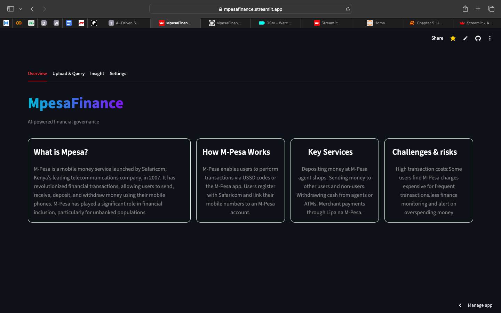
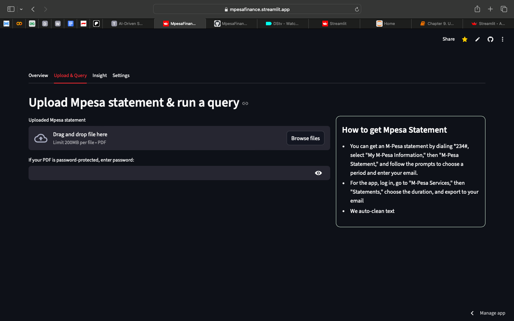
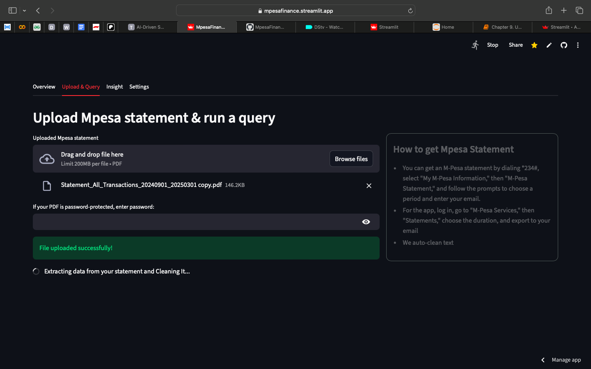
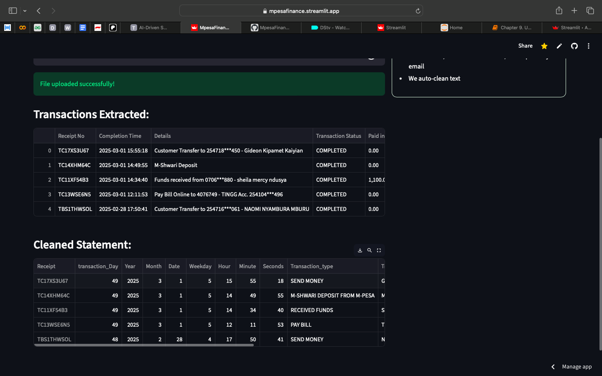
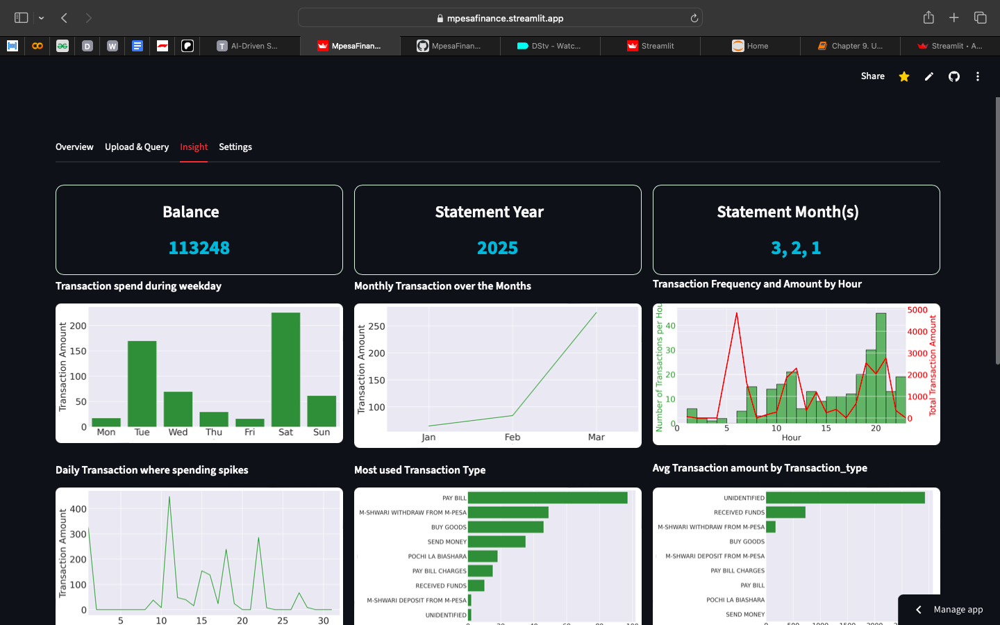
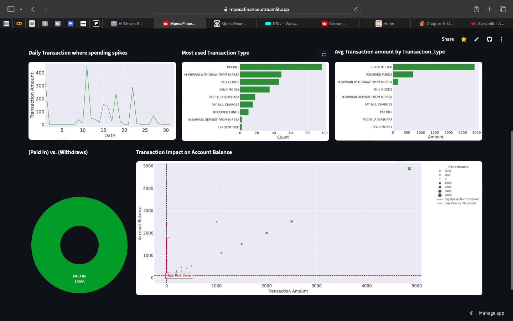

# M-Pesa Finance App

>   AppLink: [[Mpesa Finance App](https://mpesafinance.streamlit.app)]
---

---

The M-Pesa Finance App is an AI-powered personal finance assistant built to clean your M-Pesa statements, analyze transactions, detect spending patterns, and forecast future expenses. Think of it as your budget’s watchdog — but smarter and way less dramatic.

## Features
• Automated Data Extraction
1)   Upload your M-Pesa PDFs
2)   The app parses → cleans → structures your data
3)   Removes footers, line breaks, duplicated spaces, inconsistent fields

• Data Preprocessing & Cleaning
1)   Handles messy formats and weird characters (like Withdraw\r\n)
2)   Converts dates, balances, and amounts correctly
3)   Detects outliers using IQR
4)   Normalizes and standardizes transaction categories

• Interactive Analysis Dashboard
1)   Total expenses, income, balances
2)   Category-wise insights (Send Money, Buy Goods, PayBill, Withdraw, etc.)
3)   Time filters (daily, weekly, monthly)
4)   Dynamic trend visualizations

• Forecasting Engine (AI + Time Series Models)
1)   Uses Prophet / ARIMA to forecast expenses
2)   Evaluates predictions using RMSE and MAE
3)   Supports future multivariate forecasting
4)   Predicts upcoming spending trends

• Smart Alerts & Insights
1)   Flags suspicious or unusual spending
2)   Notifies about overspending streaks
3)   Visualize your spendings

• Image & Report Saving
1)   Export charts and analysis screenshots directly
2)   Useful for financial tracking or monthly reports

# Installation
1. Clone the repository
``` bash
https://github.com/Brian342/MpesaFinance
cd MpesaApp
```

2. Install dependencies
```
pip install -r requirements.txt
```

4. Run the app
```
streamlit run MpesaApp.py
``` 
---
# Screenshots
---
## Upload Query 


---

## Extraction Data


---

##  Cleaned Data

---

##  DashBoard Data

---

##  DashBoard Data
   
---

# Tech Stack

>   Python

>   Streamlit

>   Pandas / NumPy

>   Prophet / ARIMA

>   Matplotlib / Plotly

>   Django (future API)

# License

This project is licensed under the MIT License.
See the LICENSE file for more details.
